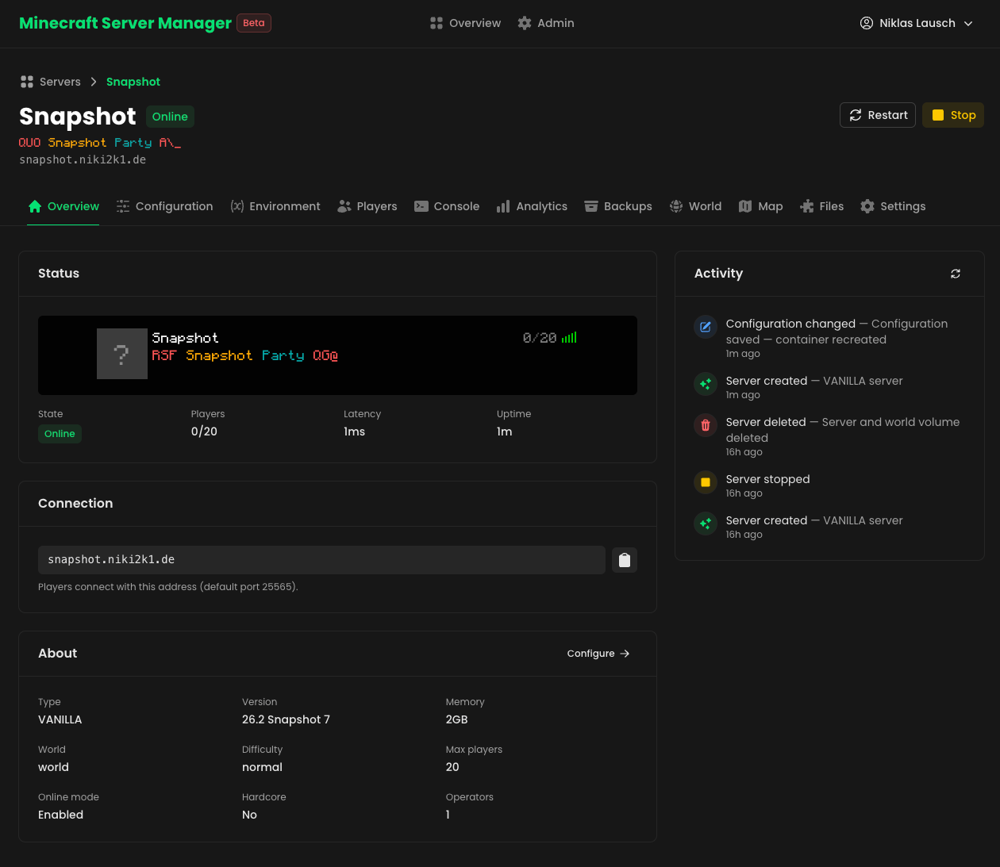
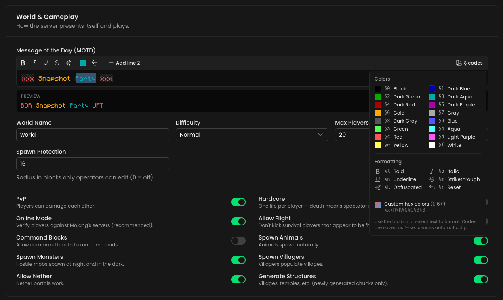
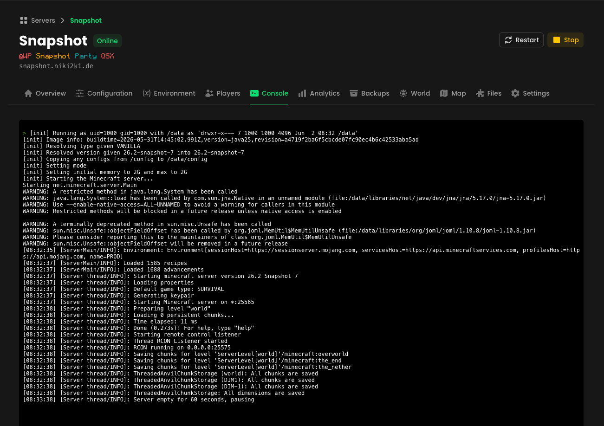
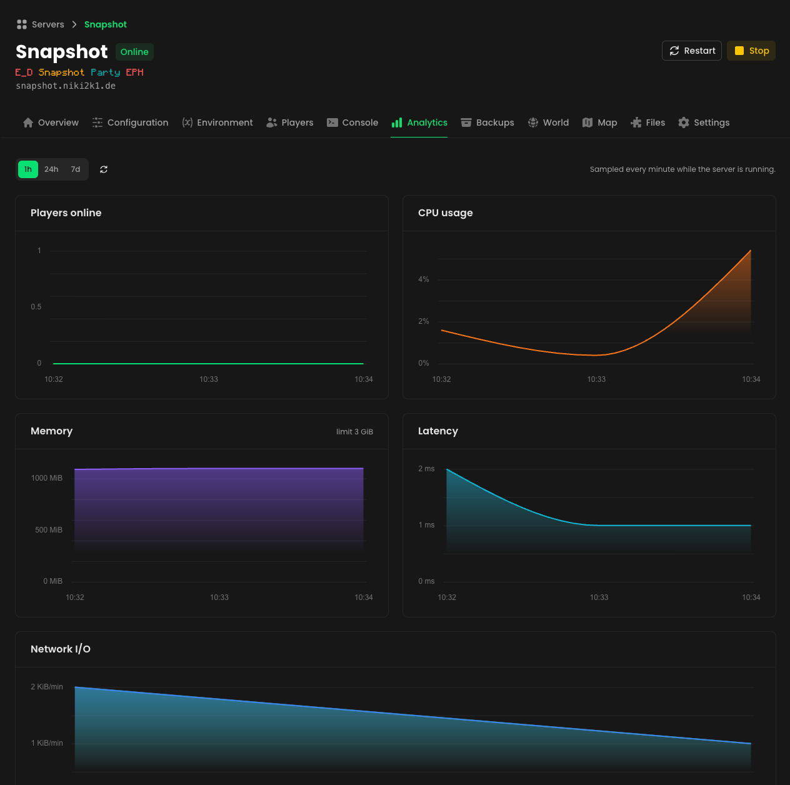
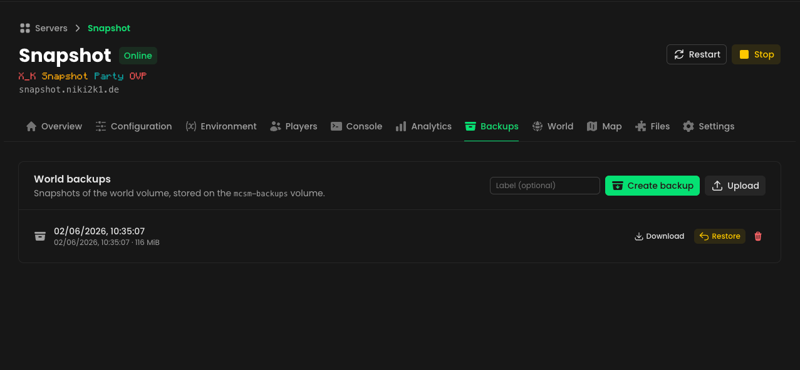
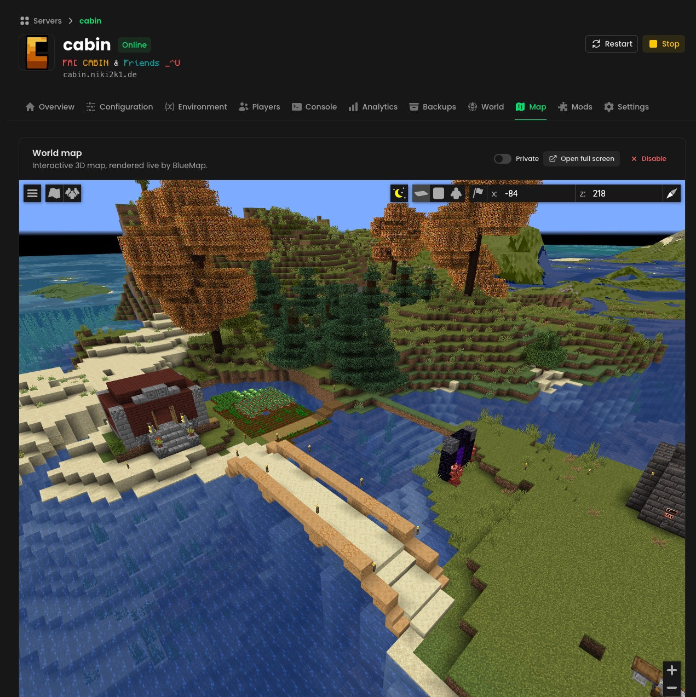
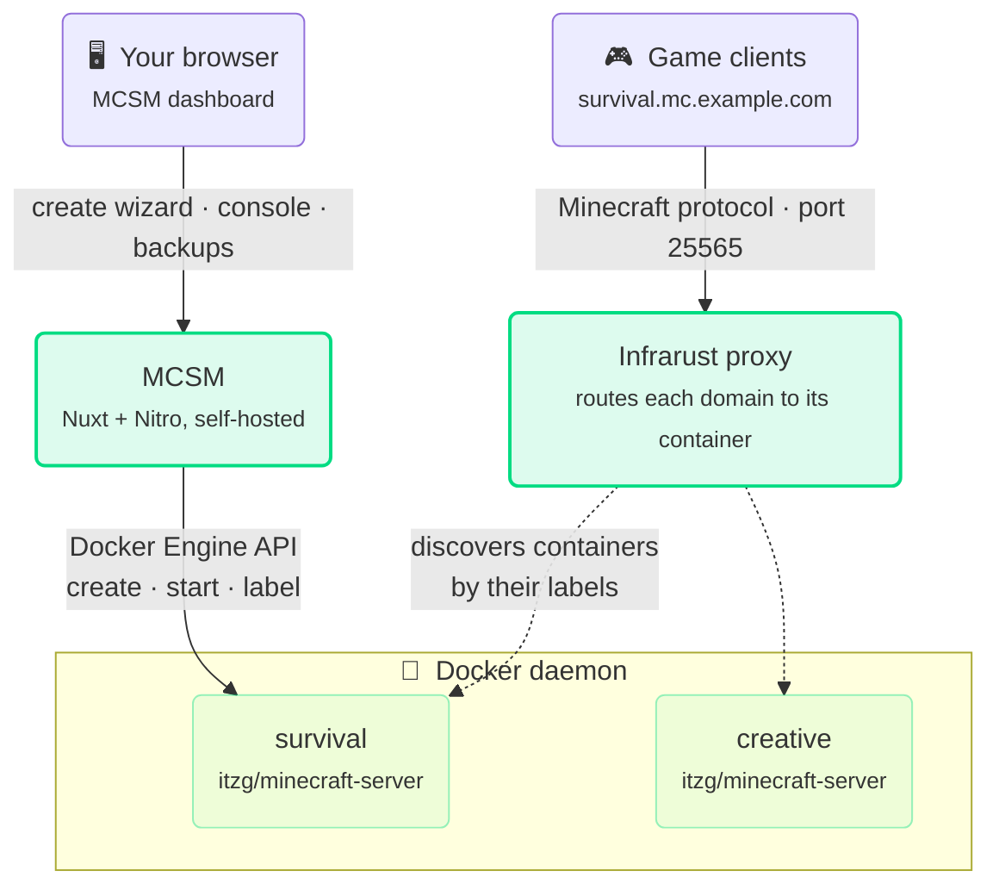

# MCSM — Minecraft Server Manager

A self-hostable web app for spinning up and managing Minecraft servers. MCSM
gives you a guided wizard to configure a server — type, version, memory,
world settings, MOTD, operators and whitelist — and then provisions it for you
as a Docker container running the
[`itzg/minecraft-server`](https://github.com/itzg/docker-minecraft-server)
image. Routing is handled by [Infrarust](https://github.com/Shadowner/Infrarust),
which discovers each server from its Docker labels — so there are no proxy
config files to manage.



> **Status:** early / work in progress. APIs and structure may change.

> **Docs:** a full documentation site lives in [`docs/`](docs/) (built with
> [Docus](https://docus.dev)) — run it locally with `cd docs && pnpm install && pnpm dev`.

## Features

Every server gets its own set of pages in the dashboard: **Overview,
Configuration, Environment, Players, Console, Analytics, Backups, World, Map,
Files and Settings** — plus a guided 4-step wizard (Type → Details →
Properties → Review) for creating new servers.

- **Login & accounts** — the dashboard and API are behind a login
  ([nuxt-auth-utils](https://github.com/atinux/nuxt-auth-utils)): password,
  passkeys (WebAuthn) and "Sign in with Microsoft". A first-run wizard creates
  the admin account; more users, domains and API keys (e.g. CurseForge) are
  managed from the Admin panel. Published BlueMaps stay reachable without a
  login.
- **Full lifecycle from the dashboard** — create, start, stop, restart, edit
  and delete servers. Editing recreates the container with the new config while
  keeping the world volume; every action lands in a per-server activity feed.
- **In-game server list preview** — see your server exactly as players do:
  icon, live MOTD, player count and latency, rendered in the Minecraft font.
- **Multiple server types** — Vanilla, Paper, Fabric, Forge, Feed The Beast
  and CurseForge modpacks.
- **Operators & whitelist** — look players up by username; their UUID and skin
  avatar are resolved from Mojang automatically. Online players can be kicked
  or banned right from the Players tab.
- **Mods, plugins & config files** — upload custom `.jar` files (or `.zip`
  bundles) straight into a server's mods/plugins folder, and edit plugin/mod
  and server config files in a built-in Monaco editor — with server-side
  YAML/JSON validation so a typo can't take the server down.
- **Modrinth browser & updates** — search [Modrinth](https://modrinth.com)
  right from the dashboard, filtered to builds compatible with the server's
  loader and Minecraft version, and install them (plus required dependencies)
  in one click. Installed jars are identified by their SHA-1 hash, so anything
  on Modrinth — even manually uploaded files — gets an "update available"
  badge and one-click updates.
- **Direct Docker provisioning** — creates the container straight against the
  Docker Engine API (via [`dockerode`](https://github.com/apocas/dockerode)),
  with env vars, a memory limit, a persistent volume and Infrarust labels.
- **Label-based routing** — Infrarust watches the same Docker daemon, discovers
  the container by its `infrarust.*` labels and routes the chosen domain to it.

### Configuration & live MOTD editor

Edit game rules, difficulty, world settings and more from the Configuration
tab. The MOTD editor supports `§` color/format codes and 1.16+ hex colors,
with a live preview in the Minecraft font — including obfuscated-text
animation. Minecraft versions are pulled from
[`minecraft-data`](https://github.com/PrismarineJS/minecraft-data), and custom
container environment variables can be set on the Environment tab.



### In-app console

An [xterm.js](https://xtermjs.org) terminal streams the server console live
(over SSE) and runs commands via RCON, right from the dashboard.



### Analytics

CPU, memory, network I/O, latency and player count are sampled every minute
while a server runs, and charted over 1-hour, 24-hour and 7-day ranges.
Metrics are keyed by the world volume, so history survives config edits and
container recreation.



### World backups

Snapshot the world volume to a tarball with one click (or on upload), then
download, restore or delete backups from the Backups tab. Backups are stored
on a dedicated `mcsm-backups` Docker volume and restored without ever needing
exec access to the host.



### World pre-generation & BlueMap

Generate chunks ahead of time with [Chunky](https://modrinth.com/mod/chunky)
(auto-installed), watched live on a Minecraft-style chunk colormap. Toggle an
interactive [BlueMap](https://bluemap.bluecolored.de/) 3D world map — MCSM
auto-installs it and serves it through its own domain at `/map/<server>/`, no
extra ports, proxies or DNS needed. Maps can be published so they're viewable
without a login.



## How it works



1. You fill out the wizard; state lives client-side until the **Review** step.
2. On **Create Server**, the Nitro API (`/api/server/create`) creates a Docker
   container from the `itzg/minecraft-server` image with:
   - every setting as an env var (`TYPE`, `MOTD`, `DIFFICULTY`, `MAX_PLAYERS`,
     `VERSION`, `OPERATORS`, `WHITELIST`, `MEMORY`, …),
   - a hard memory limit and a named volume mounted at `/data`,
   - attachment to the shared Docker network, and
   - the Infrarust labels below.
3. **Infrarust** — running on the same daemon with its docker provider enabled —
   sees the new container, reads its labels and starts routing immediately. No
   file is written and no shared volume of configs is needed.

```yaml
labels:
  infrarust.enable: "true"
  infrarust.domains: "my-server.example.com"
  infrarust.port: "25565"
  infrarust.proxy_mode: "passthrough"
  mcsm.managed: "true"
  mcsm.name: "My Server"
  mcsm.config: "{…full wizard config as JSON…}"
```

**Docker is the source of truth for server config.** The full wizard config is
stashed in the `mcsm.config` label, so the dashboard lists servers by querying
Docker directly (`/api/server`, filtered on `mcsm.managed=true`), pings each
domain for live status, and prefills the edit form straight from the label.
Editing recreates the container (reusing its name and volume) since Docker
can't mutate env/labels in place.

Everything that has to survive container recreation lives in a local **SQLite
database** (NuxtHub + [Drizzle](https://orm.drizzle.team)) at
`.data/db/sqlite.db`: analytics samples, the activity feed, backup metadata,
pre-generation tasks, user accounts and passkeys, domains and API keys. These
records are keyed by the server's **world volume name** rather than the
container ID, so they follow the server across edits.

## Tech stack

| Area        | Technology |
| ----------- | ---------- |
| Framework   | [Nuxt 4](https://nuxt.com) (Vue 3, TypeScript, SPA), Nitro server |
| UI          | [Nuxt UI v4](https://ui.nuxt.com) (Pro components included, no license), Tailwind CSS v4 |
| Database    | SQLite via [NuxtHub](https://hub.nuxt.com) + [Drizzle ORM](https://orm.drizzle.team) (analytics, activity, backups, users, domains) |
| Validation  | [Zod](https://zod.dev) via `h3-zod` |
| Auth        | [nuxt-auth-utils](https://github.com/atinux/nuxt-auth-utils) (password, WebAuthn passkeys, Microsoft OAuth) |
| Provisioning | [dockerode](https://github.com/apocas/dockerode) → Docker Engine API |
| Console     | [xterm.js](https://xtermjs.org) + SSE (logs), [rcon-client](https://github.com/janispritzkau/rcon-client) (commands) |
| MC proxy    | [Infrarust](https://github.com/Shadowner/Infrarust) (Docker-label discovery) |
| MC data     | `minecraft-data`, `@sfirew/minecraft-motd-parser`, `@ahdg/minecraftstatuspinger`, `jimp` (skin rendering) |

## Self-hosting

### Prerequisites

- **Node.js 20+** and **[pnpm](https://pnpm.io)** (`pnpm@9` is pinned via
  `packageManager`).
- A **Docker daemon** MCSM can reach (local socket or a remote TCP/TLS host).
- **[Infrarust](https://github.com/Shadowner/Infrarust)** running against the
  same daemon with its docker provider enabled and joined to the shared
  network, e.g.:
  ```yaml
  docker_provider:
    docker_host: "unix:///var/run/docker.sock"
    label_prefix: "infrarust"
    watch: true
  ```
- A shared **Docker network** (default name `infrarust`) that both Infrarust
  and the created Minecraft containers join.

### 1. Clone and install

```bash
git clone https://github.com/Niki2k1/mcsm.git
cd mcsm
pnpm install
```

### 2. Configure environment

Copy the example file and adjust as needed:

```bash
cp .env.example .env
```

Config is supplied through Nuxt `runtimeConfig`, so overrides must use
`NUXT_`-prefixed environment variables that mirror its structure (plain names
like `DOCKER_HOST_ADDR` are only read at build time and are ignored by the
built server — see [Nuxt runtime config](https://nuxt.com/docs/guide/going-further/runtime-config)).

| Variable                              | Required | Description |
| ------------------------------------- | -------- | ----------- |
| `NUXT_SESSION_PASSWORD`               | ✅       | Encrypts login session cookies (min. 32 chars, e.g. `openssl rand -base64 32`). Auto-generated in dev; without it in production every restart logs everyone out. |
| `NUXT_DOCKER_HOSTS_DEFAULT_SOCKET_PATH` | ✅     | Path to the Docker socket MCSM provisions on. Defaults to `/var/run/docker.sock`. |
| `NUXT_DOCKER_NETWORK`                 | ✅       | Shared Docker network Infrarust and the MC containers join. Default `infrarust`. |
| `NUXT_DOCKER_IMAGE`                   | –        | Server image. Default `itzg/minecraft-server`. |
| `NUXT_RCON_PASSWORD`                  | –        | RCON password set on every server for the console. Default `minecraft`. Change it. |
| `NUXT_RCON_PORT`                      | –        | RCON port inside the container. Default `25575` (never published). |
| `NUXT_INTERNAL_URL`                   | –        | URL where the Minecraft containers reach MCSM on the shared Docker network (for icon downloads). Default `http://mcsm:3000`. |
| `NUXT_SESSION_MAX_AGE`                | –        | Login session lifetime in seconds. Default 1 week. |
| `NUXT_DOCKER_HOSTS_DEFAULT_HOST`      | –        | Remote Docker daemon host. When set, takes precedence over the socket. |
| `NUXT_DOCKER_HOSTS_DEFAULT_PORT` / `..._PROTOCOL` / `..._CA` / `..._CERT` / `..._KEY` | – | Remote daemon port and TLS material. |
| `NUXT_OAUTH_MICROSOFT_CLIENT_ID` / `..._CLIENT_SECRET` / `..._TENANT` | – | Enables "Sign in with Microsoft" (Entra ID app registration; redirect URI `https://<your-domain>/auth/microsoft`). The login button only shows when configured. |

#### Authentication

On first launch MCSM shows a setup wizard that creates the admin account.
There is no open registration — additional users are created from the **Admin
panel**. Each user can sign in with their password, register **passkeys**
(Touch ID, Windows Hello, security keys) from the user menu, or use **Sign in
with Microsoft** if their account email matches an MCSM user.

### 3. Secure the Docker socket ⚠️

MCSM provisions by talking to the Docker Engine API, and a web app with raw
socket access is effectively **root on the host**. In production, do **not**
mount the bare socket — put a restricted proxy such as
[`tecnativa/docker-socket-proxy`](https://github.com/Tecnativa/docker-socket-proxy)
in front of it, allow only the endpoints MCSM needs (containers, images,
networks, volumes), and point `NUXT_DOCKER_HOSTS_DEFAULT_SOCKET_PATH` /
`NUXT_DOCKER_HOSTS_DEFAULT_HOST` at the proxy.

### 4. Run

**Development** (hot reload on `http://localhost:3000`):

```bash
pnpm dev
```

**Production build & start:**

```bash
pnpm build
pnpm start
```

> Nuxt UI v4 includes the former Pro components for free, so no
> `NUXT_UI_PRO_LICENSE` is needed to build.

MCSM persists its SQLite database and uploaded icons to the `.data/`
directory, so mount it as a volume if you containerize the app. See the
[Nuxt deployment docs](https://nuxt.com/docs/getting-started/deployment) for
other targets.

### 5. Add a domain

The wizard's domain options come from the database. After logging in, open the
**Admin panel → Domains** and add at least one domain (e.g. `mc.example.com`)
— the chosen `subdomain.domain` becomes the value of the container's
`infrarust.domains` label.

## Deploy with Docker Compose (Coolify)

The repo ships a turnkey stack so you don't have to wire the pieces yourself:

- **`Dockerfile`** — builds the MCSM image.
- **`.github/workflows/docker-publish.yml`** — builds a multi-arch image and
  pushes it to **GHCR** (`ghcr.io/<owner>/mcsm`) on push to `main`, on `v*`
  tags, or via manual dispatch.
- **`docker-compose.yml`** — runs three services on two networks:
  - `mcsm` (the app), `infrarust` (the proxy) and `docker-socket-proxy`.
  - **Neither MCSM nor Infrarust mounts the raw Docker socket** — both reach it
    through the socket proxy over TCP, restricted to the endpoints they need.
  - The `infrarust` network is shared with the Minecraft containers MCSM
    creates; `dockerproxy` is internal (Docker API only).
- **Infrarust config** — defined inline (as TOML) in `docker-compose.yml`'s
  top-level `configs:` block and injected at `/app/config/config.toml`; it
  enables Infrarust's `[docker]` provider against the socket proxy. (Inlined
  rather than bind-mounted because Coolify mishandles single-file bind mounts.)

### Coolify

1. Push to `main` (or run the workflow manually) so the image publishes to
   GHCR, then make the GHCR package **public** — or add registry credentials in
   Coolify so it can pull.
2. In Coolify: **New Resource → Docker Compose**, point it at this repo (or
   paste `docker-compose.yml`).
3. Assign a domain to the **`mcsm`** service on port `3000` (Coolify fills the
   `SERVICE_FQDN_MCSM_3000` magic variable and routes HTTPS to it).
4. Point the DNS for your Minecraft domain (e.g. a wildcard `*.mc.example.com`)
   at the host — Infrarust listens on `25565`.
5. Deploy, run the first-launch setup wizard, then **add at least one domain**
   in the Admin panel (the create wizard needs it).

### Plain Docker

```bash
git clone https://github.com/Niki2k1/mcsm.git
cd mcsm
# uncomment the mcsm `ports:` block in docker-compose.yml to expose the UI
docker compose up -d
```

The MCSM UI is then on `http://localhost:3000` and Minecraft on `:25565`.

## Project structure

```
app/
  components/
    admin/               # Admin panel: users, domains, secrets, health checks
    auth/                # Login shell, passkey registration modal
    server/
      Card.vue           # Per-server card on the dashboard
      Status.vue         # Dashboard list (queries /api/server)
      FormModal.vue      # 4-step create wizard modal
      ListPreview.vue    # In-game server list preview (icon, MOTD, ping)
      steps/             # Wizard steps: type, details, ServerProperties, Review
      detail/            # Server page tabs: Overview, Configuration, Environment,
                         #   Players, Console, Analytics, Backups, World, Map,
                         #   Files, Settings (+ ActivityFeed, ModrinthBrowser,
                         #   ChunkColormap)
      motd/              # MOTD editor, preview renderer, § code legend
    user/                # Player lookup list (operators / whitelist)
  composables/           # create-form, server-detail, server-modal, MOTD parser
  pages/
    index.vue            # Server overview / dashboard
    login.vue, setup.vue # Login + first-run admin setup
    admin.vue            # Admin panel
    server/[id]/         # Per-server pages, one route per tab
server/
  api/
    server/              # create, list; per-server: start/stop/restart, logs (SSE),
                         #   rcon, players, stats + history, activity, backups,
                         #   files, jars, modrinth, bluemap, pregen, icon
    admin/               # secrets, settings, status & health checks
    auth/ users/ me/     # login, setup, OAuth providers, users, passkeys
    domains/             # list / create / delete domains
    minecraft/           # versions, player profile, skin, server status
  db/
    schema.ts            # Drizzle schema: stats, activity, backups, pregen tasks,
                         #   users, credentials, secrets, settings, domains
    migrations/          # SQL migrations (applied at startup)
  plugins/               # stats sampler (1-min interval), migrations runner
  utils/
    useDocker.ts         # dockerode client (provision / list / get / remove)
    serverSpec.ts        # wizard config -> env + labels + volume
    backups.ts           # tar-based volume snapshots via helper containers
    activity.ts          # activity feed recording
    bluemap.ts pregen.ts # BlueMap / Chunky integrations
    minecraft/           # skin rendering, status pinger, Modrinth client
  routes/map/            # BlueMap proxy (/map/<server>/)
  schema/server.schema.ts # shared zod config schema
public/                  # Monocraft font, favicon
docs/                    # screenshots, design notes
nuxt.config.ts           # modules, runtimeConfig (docker hosts), NuxtHub
```

## Caveats

- **Single Docker host by default.** `useDocker(hostId)` resolves daemons from
  `runtimeConfig.docker.hosts`, so multiple hosts can be added later, but only
  `default` is wired up today.
- **RCON is shared-secret and internal.** Every server gets RCON enabled with
  the `RCON_PASSWORD` MCSM knows; the port is never published, so it's only
  reachable on the internal Docker network. Existing servers gain RCON the next
  time they're recreated (an edit).
- **Per-server MOTD/offline status** is set as an env var on the container; the
  richer offline-status placeholder behaviour of file-based proxies isn't
  modelled through Infrarust labels. (Infrarust v2 offers more here — see
  [docs/infrarust-v2-features.md](docs/infrarust-v2-features.md) for what MCSM
  could adopt.)
- **BlueMap traffic flows through MCSM.** The map is proxied by the dashboard
  (`/map/<volume>/` → container port 8100 over the shared Docker network), so
  it shares MCSM's domain and TLS. Map tiles are served by the Node process —
  fine for personal use, but heavy public maps would benefit from dedicated
  routing.
- **Chunky/BlueMap on CurseForge modpacks need Minecraft 1.13.2+.** Both are
  installed from Modrinth against the modpack's resolved mod loader; packs on
  older Minecraft versions have no compatible build, and the container will
  fail to start until the integration is disabled again.
- This is an early-stage project and APIs/structure may change.

## License & attribution

MCSM is licensed under the [MIT License](LICENSE).

The MIT license covers the code in this repository — including the
[`infrarust/Dockerfile`](infrarust/Dockerfile) build recipe — but **not** the
Infrarust binary that the published `mcsm-infrarust` image redistributes,
which remains AGPL-3.0 (see below).

### Infrarust

The proxy image this stack runs (`ghcr.io/niki2k1/mcsm-infrarust`) is a rebuild
of [Infrarust](https://github.com/Shadowner/Infrarust) by
[Shadowner](https://github.com/Shadowner), licensed under the
[GNU AGPL-3.0](https://github.com/Shadowner/Infrarust/blob/master/LICENSE).

Changes from upstream (both in [`infrarust/Dockerfile`](infrarust/Dockerfile)):

- the optional `infrarust-core/docker` cargo feature is compiled in, so
  Docker-label discovery works (upstream images ship without it);
- a one-line duplicate-import fix that feature needs to compile.

The corresponding source for the published image is the upstream repository at
the ref pinned in the Dockerfile, plus the Dockerfile itself. The image ships
the upstream license text at `/licenses/Infrarust-LICENSE`.

MCSM itself only talks to Infrarust over Docker labels and runs it as a
separate container — it doesn't link against or derive from Infrarust code.
